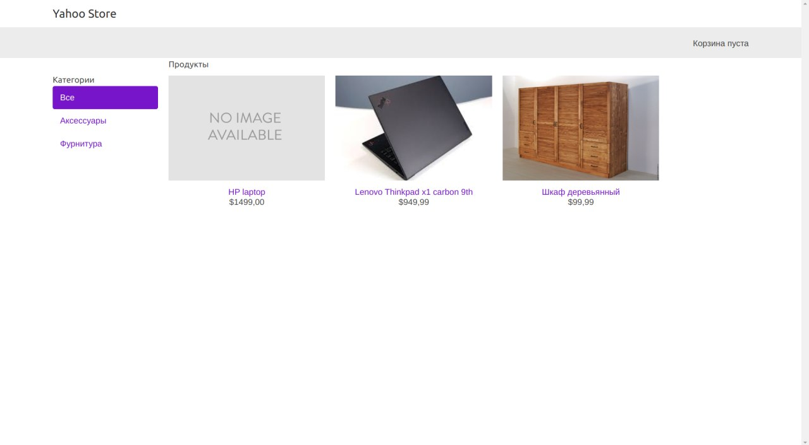

# Yahoo Store

**Yahoo Store** is a Django-based e-commerce platform that allows you to create and manage an online store. This repository contains the source code and documentation for the project.

## Table of Contents

- [Introduction](#introduction)
- [Features](#features)
- [Getting Started](#getting-started)
  - [Prerequisites](#prerequisites)
  - [Installation](#installation)
  - [Configuration](#configuration)
- [Usage](#usage)
- [Contributing](#contributing)
- [License](#license)

## Introduction

Yahoo Store is a powerful e-commerce platform built with Django. It provides a feature-rich environment for setting up and managing your online store. From product catalog management to order processing, Yahoo Store has you covered.

## Features

List the key features of your Yahoo Store project:

- User-friendly admin panel for managing products, categories, and orders.
- Product catalog with support for images, descriptions, and pricing.
- Secure user authentication and registration.
- Shopping cart functionality for customers to add and review items.
- Seamless checkout and payment processing integration.
- Order history and tracking for both customers and administrators.
- Customizable themes and templates for branding your store.
- Search functionality to easily find products.
- Support for multiple payment gateways.
- Responsive design for mobile and desktop.

## Getting Started

Explain how to get started with your project using Django. This section should guide users on setting up and running your project on their local machines.

### Prerequisites

List any software, tools, or dependencies that users need to have installed before they can use your project:

- Python (version 3.11.2)
- Django (version 4.1.10)
- Virtual environment (optional but recommended)
- Database (e.g., PostgreSQL, SQLite)
- Git

### Installation

Provide step-by-step instructions on how to install your project and its dependencies:

1. Clone the repository:

   ```bash
   git clone https://github.com/atabekdemurtaza/Yahoo-Store.git
   ```

2. Change to the project directory:

   ```bash
   cd Yahoo-Store
   ```

3. Create and activate a virtual environment (optional but recommended):

   ```bash
   python -m venv venv
   source venv/bin/activate
   ```

4. Install Python dependencies:

   ```bash
   pip install -r requirements.txt
   ```

### Configuration

Explain any configuration steps that users need to follow, such as setting up a database, secret keys, or environment variables.

## Usage

Explain how to use your Yahoo Store built with Django. Provide examples and code snippets if applicable. You can also include screenshots or GIFs to illustrate usage.

```python
# Provide Django code examples here
```

## Contributing

Explain how others can contribute to your project, whether it's through bug reports, feature requests, or code contributions. Include guidelines for pull requests if applicable.

## License

Specify the license under which your project is distributed:

This project is licensed under the MIT License - see the [LICENSE](LICENSE) file for details.

---

Feel free to adapt and extend this template to suit your Django-based Yahoo Store project's specific needs. Include any additional sections or information that would be helpful for users and contributors.

--- 

## Homepage


